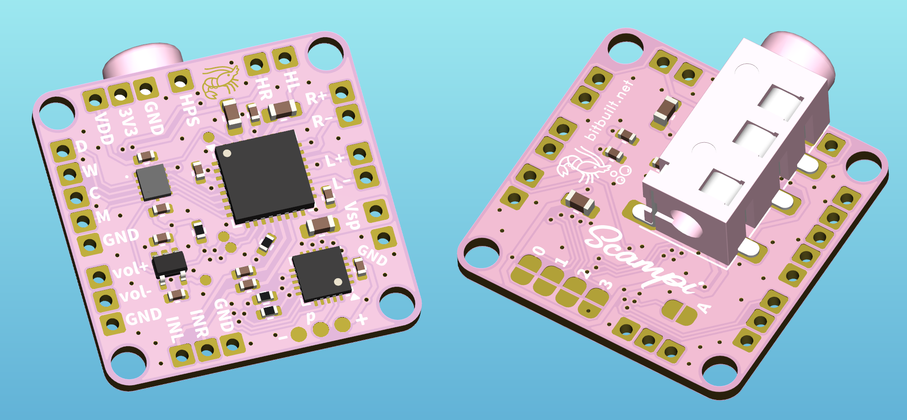
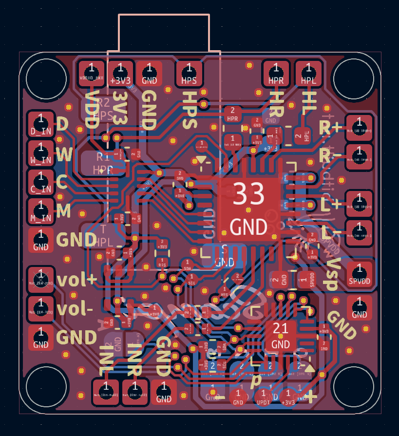

<picture> <source media="(prefers-color-scheme: dark)" srcset="images/logo.png">  </picture> 

Scampi is a truly universal OSHW audio amp for portablizers. Hardware design is tested and working. Firmware is nearly complete.

 

Features:

- Low-cost 20x20mm 2-layer PCB
- TLV320AIC3110 codec with stereo 1.3W Class-D amps and Class-AB headphone driver
- 5V-tolerant level-shifted I2S input + analog input
- Onboard switching 3.5mm headphone jack
- Solder jumpers for mode selection (15 modes planned)
- Shrimp-themed!🦐
  

Hardware tested and working! Firmware is nearly complete! Supported modes so far:

- [ ] Analog input
- [x] SNES
- [x] N64
- [ ] GameCube
- [x] Wii
- [ ] Wii U
- [ ] PS1
- [ ] PS2
- [ ] PS3
- [ ] Saturn
- [x] Dreamcast
- [ ] XBOX
- [ ] Xbox 360
- [ ] Jaguar
- [ ] Neo Geo

## License
Solderpad Hardware License v2.1
